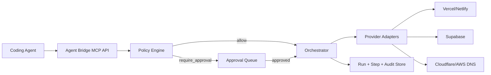

# Agent Bridge MCP

MCP-style control plane for coding agents.

Connect cloud services once, then let any coding agent execute normalized actions safely across providers.

## Why This Exists

Building features is fast. Wiring infra across Supabase, Vercel, DNS, env vars, and production approvals is what slows teams down.

`void-thing` solves that by providing one API surface for agentic infra actions:

- One tool contract
- Multi-provider execution
- Policy + approval gates
- Idempotent runs
- Auditable action history

## Overview

Most agent demos generate code. This one controls real delivery workflows.

With one request, an agent can:

1. Deploy a preview
2. Provision/update infra
3. Attach DNS/domain settings
4. Respect production approval rules
5. Produce a full run + step audit trail

This is the missing layer between coding agents and real-world deployment systems.

## Core Features

- Unified action endpoint: `POST /v1/actions/execute`
- Normalized toolset:
  - `deploy_preview`
  - `provision_db`
  - `run_migration`
  - `set_env_var`
  - `attach_domain`
  - `create_dns_record`
  - `rollback_run`
  - `list_connections`
- Policy engine:
  - `allow`
  - `deny`
  - `require_approval`
- Approval flow for risky/prod operations
- Idempotency support via `idempotency_key`
- Structured run tracking:
  - run state
  - per-step execution
  - rollback metadata
  - audit events
- OAuth + webhook stubs for provider onboarding/events

## Architecture



## Repository Layout

- `src/server.ts`: server bootstrap + route registration
- `src/routes/`: API endpoints
- `src/services/orchestrator.ts`: execution engine
- `src/services/policy.ts`: policy evaluation
- `src/services/store.ts`: in-memory state store (runs/steps/approvals/audit/connections)
- `src/providers/`: provider adapter contracts + mock adapters
- `db/schema.sql`: production data model for PostgreSQL

## Quick Start

### Prerequisites

- Node.js 20+
- npm 10+

### Install + Run

```bash
npm install
npm run dev
```

Server default: `http://localhost:8787`

### Validate Build

```bash
npm run typecheck
npm run build
```

## API Surface

- `GET /health`
- `POST /v1/actions/execute`
- `GET /v1/runs/:runId`
- `GET /v1/runs/:runId/steps`
- `POST /v1/approvals/:approvalId/respond`
- `GET /v1/projects/:projectId/connections`
- `POST /v1/oauth/:provider/start`
- `GET /v1/oauth/:provider/callback`
- `POST /v1/webhooks/:provider`

## 5-Minute Demo Script (Use This to Present)

### 1) Health Check

```bash
curl http://localhost:8787/health
```

Expected: `{"ok":true,"service":"agent-bridge-mcp"}`

### 2) List Connected Providers (seeded)

```bash
curl http://localhost:8787/v1/projects/project-demo/connections
```

### 3) Preview Deployment (No Human Needed)

```bash
curl -X POST http://localhost:8787/v1/actions/execute \
  -H 'content-type: application/json' \
  -d '{
    "request_id":"demo-req-1",
    "idempotency_key":"preview-main-demo-1",
    "tool":"deploy_preview",
    "project_id":"project-demo",
    "environment":"preview",
    "requested_by":{"user_id":"user-1","agent_name":"claude-code"},
    "params":{"git_ref":"feature/launch"}
  }'
```

### 4) Risky Prod Action Triggers Approval

```bash
curl -X POST http://localhost:8787/v1/actions/execute \
  -H 'content-type: application/json' \
  -d '{
    "request_id":"demo-req-2",
    "tool":"run_migration",
    "project_id":"project-demo",
    "environment":"prod",
    "requested_by":{"user_id":"user-1","agent_name":"claude-code"},
    "params":{"migration_ref":"20260418_add_users","strategy":"safe"}
  }'
```

Expected: run enters `waiting_approval` and includes an `approval.id`.

### 5) Approve and Continue Execution

```bash
curl -X POST http://localhost:8787/v1/approvals/<approval-id>/respond \
  -H 'content-type: application/json' \
  -d '{"decision":"approved","decided_by":"admin-1"}'
```

### 6) Show Auditability

```bash
curl http://localhost:8787/v1/runs/<run-id>
curl http://localhost:8787/v1/runs/<run-id>/steps
```

## Request Schema (Canonical)

```json
{
  "request_id": "string",
  "idempotency_key": "string (optional)",
  "tool": "deploy_preview | provision_db | run_migration | set_env_var | attach_domain | create_dns_record | rollback_run | list_connections",
  "provider": "vercel | netlify | supabase | cloudflare | aws | github | auto (optional)",
  "project_id": "string",
  "environment": "dev | preview | staging | prod",
  "dry_run": false,
  "requested_by": {
    "user_id": "string",
    "agent_name": "string",
    "session_id": "string (optional)"
  },
  "params": {},
  "meta": {}
}
```

## Policy and Approval Behavior

Built-in seeded policy examples:

- `require_approval`: prod migration
- `require_approval`: prod DNS update
- `deny`: force migration in prod

Execution outcomes:

- Allowed: run executes immediately
- Approval required: run pauses in `waiting_approval`
- Denied: API returns `POLICY_DENIED`

## Data Model

Production schema is available in [db/schema.sql](./db/schema.sql), including:

- orgs/users/projects/environments
- service connections + project bindings
- policies + approvals
- runs + run_steps
- audit_events

## Current MVP Scope

Implemented now:

- Full orchestration API and flow
- Mock provider adapters for instant demo reliability
- In-memory state store
- SQL schema for persistence upgrade path

Not yet implemented:

- Real OAuth token vault
- Real provider SDK/API calls
- Durable DB-backed runtime state
- AuthN/AuthZ middleware for multi-tenant production

## Novelty

1. It is agent-agnostic infrastructure, not tied to one coding model.
2. It standardizes provider actions into one contract.
3. It adds governance (policy + approval) without breaking agent velocity.
4. It provides auditability and idempotent execution, which are required for production trust.

## Roadmap (Post-Hackathon)

1. Replace mock adapters with real providers (Supabase, Vercel, Cloudflare first).
2. Move runtime state from memory to Postgres tables in `db/schema.sql`.
3. Add signed webhooks, scoped API keys, and RBAC middleware.
4. Publish MCP server wrapper so agents can call tools directly.
5. Add retry/circuit-breaker and compensation workflows for multi-step actions.

## License

MIT
